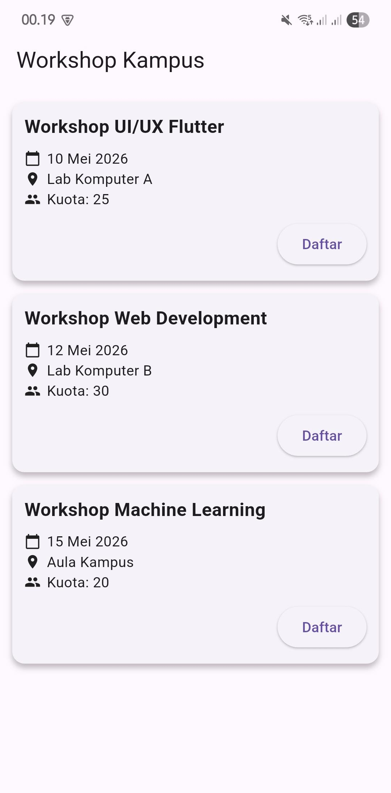

# APLIKASI WORKSHOP FLUTTER

## 👤 IDENTITAS

* NIM  : 221011402522
* Nama : Fahmi Yudin
* Kelas: TI05
* Mata Kuliah: Mobile Programming
* Tahun: 2026

---

## 📱 DESKRIPSI APLIKASI

Aplikasi ini merupakan aplikasi sederhana berbasis Flutter yang digunakan untuk menampilkan daftar workshop kampus.
Setiap workshop menampilkan informasi berupa judul, tanggal, lokasi, kuota, serta tombol untuk mendaftar.

---

## 🎯 FITUR APLIKASI

* Menampilkan daftar workshop
* Menampilkan detail informasi:

    * Judul
    * Tanggal
    * Lokasi
    * Kuota
* Tombol "Daftar"
* Tampilan rapi menggunakan Card
* Scroll menggunakan ListView

---

## 🧩 WIDGET YANG DIGUNAKAN

* Scaffold
* AppBar
* ListView.builder
* Card
* Column
* Row
* Text
* Icon
* ElevatedButton
* Padding & SizedBox

---

## 🖼️ TAMPILAN APLIKASI

### Halaman Utama


---

## 📂 STRUKTUR PROJECT

```
workshop_app/
 ├── lib/
 │    └── main.dart
 ├── android/
 ├── pubspec.yaml
 ├── jawaban_soal1&2.md
 ├── README.md
```

---

## 🚀 CARA MENJALANKAN

1. Buka project di Android Studio
2. Hubungkan HP / jalankan emulator
3. Klik Run
4. Aplikasi akan tampil di device

---

## 🔗 LINK REPOSITORY

(Sesuai ketentuan dosen)

---

## 📌 CATATAN

Project ini dibuat untuk memenuhi tugas mata kuliah Mobile Programming.
